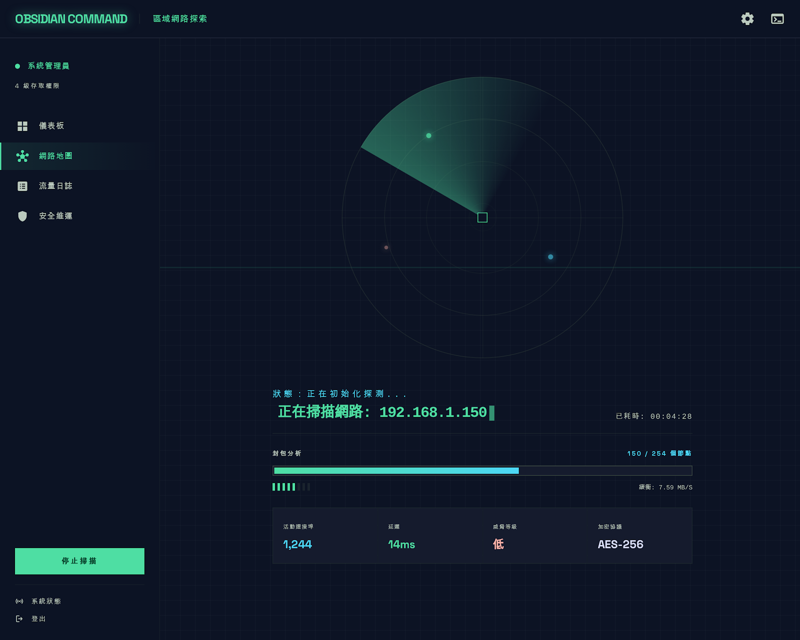

# SIP COMMANDER — 設備中央管理系統

> Electron + Vue 3 + Vite 桌面應用，用於管理區域網路內 SIP 廣播終端的完整生命週期。



---

## 功能概覽

| 功能 | 說明 | 協定 |
|------|------|------|
| 🔍 **區網掃描** | TCP 逐台探測 192.168.x.1~254，發現所有 SIP 設備 | DBP/1.0 GET |
| 🔧 **修改 IP** | 解決多台設備共用出廠 IP 衝突，逐台指派獨立 IP | DBP/1.0 SET |
| 🔊 **音頻控制** | 遠端調整播放/麥克風音量 | REST API |
| 📡 **SIP 設定** | 設定 SIP Server、組播接收、音頻編碼 | REST API |
| 📞 **通話控制** | 撥號 / 接聽 / 掛斷 | REST API |
| 🌐 **網路設定** | 修改設備 IP/Mask/Gateway/DNS | REST API |
| 📊 **即時監控** | 3 秒短輪詢設備狀態與通話狀態 | REST API |
| 🔄 **斷線重連** | 45 秒全螢幕倒數 + 自動 Ping 探測 | TCP |

## 技術架構

```
Electron Main Process (Node.js)
├── scanner.ts        — DBP/1.0 TCP 掃描器 (GET DBP/1.0)
├── ipChanger.ts      — DBP/1.0 IP 修改器 (SET DBP/1.0)
└── index.ts          — IPC Handler 註冊

Preload (contextBridge)
└── index.ts          — 安全暴露 startScan / changeIp / pingDevice

Renderer (Vue 3 + Pinia)
├── composables/
│   ├── deviceApi.ts       — 14 個 REST API 封裝 + Dirty JSON 清洗
│   ├── useDevicePolling.ts — 3 秒短輪詢
│   ├── usePromiseQueue.ts  — 批次同步佇列 (max: 5)
│   └── useReconnect.ts     — 斷線重連 composable
├── stores/
│   ├── auth.ts        — Per-IP Token 隔離字典
│   └── devices.ts     — 設備列表 (shallowRef)
└── components/
    ├── NetworkRadar.vue     — 雷達掃描動畫
    ├── DeviceTable.vue      — 設備清單 + IP 衝突偵測
    ├── DeviceDetail.vue     — 5-Tab 設備詳情 (狀態/音頻/SIP/通話/網路)
    ├── IpChangeModal.vue    — IP 修改表單 (SET DBP/1.0)
    ├── BatchSyncModal.vue   — 多台批次同步
    └── ReconnectOverlay.vue — 45 秒斷線重連遮罩
```

---

## 快速開始

### 環境需求

- **Node.js** ≥ 20.x
- **npm** ≥ 10.x
- **macOS** / **Windows** / **Linux**

### 安裝與開發

```bash
# 1. Clone
git clone git@github.com:chenshenghong/GT-SIP-Controlor.git
cd GT-SIP-Controlor

# 2. 安裝依賴
npm install

# 3. 啟動開發模式 (Electron + Vite HMR)
npm run dev
```

### 打包發佈

```bash
# macOS
npm run build:mac

# Windows
npm run build:win

# Linux
npm run build:linux
```

---

## 🔬 實機驗證交接指令

### 前置條件

1. 一台安裝好 Node.js ≥ 20 與 Git 的 **Windows / macOS 主機**
2. 該主機與 SIP 終端設備在**同一個區域網路**（例如 `192.168.1.x`）
3. 至少 **1 台以上** SIP 終端設備已通電上線

### Step 1 — 環境準備

```bash
# 確認 Node.js 版本
node -v   # 應顯示 v20.x 或以上

# Clone 專案
git clone https://github.com/chenshenghong/GT-SIP-Controlor.git
cd GT-SIP-Controlor

# 安裝依賴（含 Electron 二進位，可能需 1~2 分鐘）
npm install
```

### Step 2 — 確認 DBP Port

> ⚠️ **關鍵步驟**：DBP 協定的 TCP Port 在原始 exe 中未明確硬編碼。
> 目前預設為 `18888`，**需用 Wireshark 抓包確認**。

#### Wireshark 抓包方法

1. 在現場主機上安裝並開啟 **Wireshark**
2. 選擇主機的網路介面卡開始擷取
3. 開啟原廠工具 `QueryTool.exe`，執行一次掃描
4. 在 Wireshark 過濾欄輸入：`tcp.flags.syn == 1 && ip.dst == 192.168.1.10`
5. 觀察目標 Port 號碼（例如 `18888` 或 `9527` 等）

#### 修改 Port

確認 Port 後，編輯 `src/shared/constants.ts` 第 24 行：

```typescript
// 將 18888 改為實際抓到的 Port
export const DBP_PORT = 18888   // ← 改為正確值
```

### Step 3 — 啟動並測試

```bash
# 啟動 Electron 桌面應用
npm run dev
```

### Step 4 — 驗證清單

請依序執行以下測試並記錄結果：

#### 4.1 掃描設備

| # | 操作 | 預期結果 | 實際結果 |
|---|------|---------|---------|
| 1 | 點擊「▶ 啟動掃描」 | 雷達動畫開始旋轉、進度 0→254 遞增 | ☐ |
| 2 | 等待掃描完成 | 自動跳轉至設備清單頁面 | ☐ |
| 3 | 檢查設備清單 | 顯示已發現的設備（MAC / IP / 類型 / 韌體版本） | ☐ |
| 4 | 若有多台相同 IP | 表格顯示紅色 `×N` 標記 + 頂部衝突警告 | ☐ |

#### 4.2 修改 IP（解決出廠 IP 衝突）

| # | 操作 | 預期結果 | 實際結果 |
|---|------|---------|---------|
| 5 | 對衝突設備點「🔧 IP」按鈕 | 彈出 IP 修改 Modal | ☐ |
| 6 | 輸入新 IP（如 `192.168.1.201`）| 表單正常填入 | ☐ |
| 7 | 點「確認修改 IP」 | 顯示成功訊息 → 45 秒重連遮罩 | ☐ |
| 8 | 等待設備重啟 | 自動偵測到新 IP 後遮罩消失 | ☐ |
| 9 | 重新掃描 | 設備顯示新 IP 且無衝突 | ☐ |

#### 4.3 設備詳情管理

| # | 操作 | 預期結果 | 實際結果 |
|---|------|---------|---------|
| 10 | 點擊設備行進入詳情頁 | 顯示 5-Tab 介面 | ☐ |
| 11 | 點「▶ 開始輪詢」 | 狀態 JSON 每 3 秒更新 | ☐ |
| 12 | 切換到音頻 Tab，拉動音量滑桿 | 音量數值跟隨變動 | ☐ |
| 13 | 點「儲存音量」 | 顯示成功 → 設備實際音量改變 | ☐ |
| 14 | 切換到 SIP Tab，填入 SIP Server IP | 表單正常 | ☐ |
| 15 | 點「儲存 SIP 設定」 | 顯示成功 → 設備 SIP 註冊狀態更新 | ☐ |
| 16 | 切換到通話 Tab，輸入分機號撥號 | 設備發出撥號請求 | ☐ |
| 17 | 點掛斷 | 通話結束 | ☐ |

#### 4.4 REST API 驗證（選項）

如需獨立驗證 API，可用 curl 或 Postman：

```bash
# 登入取得 Token
curl -X POST http://192.168.1.200/auth/login \
  -H "Content-Type: application/json" \
  -d '{"username":"admin","password":"123456"}'

# 取得設備狀態（帶 Token）
curl http://192.168.1.200/get/device/status \
  -H "Authorization: Bearer <TOKEN>"

# 設定音量
curl -X POST http://192.168.1.200/set/device/volume \
  -H "Authorization: Bearer <TOKEN>" \
  -H "Content-Type: application/json" \
  -d '{"broadcast_volume":7,"microphone_volume":8}'
```

### Step 5 — 回報結果

將上方驗證清單的「實際結果」欄填寫為：
- ✅ 通過
- ❌ 失敗（附上錯誤訊息或截圖）
- ⚠️ 部分通過（說明狀況）

特別注意回報：
1. **DBP Port 號碼**（Wireshark 抓到的實際值）
2. **SET DBP/1.0 回應格式**（是否為 `DBP/1.0 200 OK`）
3. **設備回應中是否有額外欄位**（可能需補充 DeviceNode 定義）

---

## 協定文件

| 文件 | 說明 |
|------|------|
| [`docs/DBP協定-發現與修改IP.md`](docs/DBP協定-發現與修改IP.md) | DBP/1.0 TCP 設備發現與 IP 修改協定規格 |
| [`docs/GT-SIP-REST_API.md`](docs/GT-SIP-REST_API.md) | SIP 終端 REST API（14 端點）完整規格 |

## 授權

Internal Use Only — TCFNet © 2026
